# Protecting against phishing when using the OAuth 2.0 Device Authorization Grant Flow

The OAuth 2.0 Device Authorization Grant Flow (or simply Device Flow) enables devices with no browser or limited input capability, such as smart devices like Amazon Echo, to obtain an access token, that can be used by the device to access protected resource APIs. This is commonly seen on apps on Apple TV, Android TV, Amazon Echo etc. where a user is shown a QR code or link and an optional one-time authorization code and the user logs in using a companion device, like a smart phone.

The device that requires the token is called a consuming device and the one used by the user to authenticate and authorize the request is called an authorizing device. These terms will be used in this article.

Depending on how the OAuth 2.0 client is configured, it can be prone to phishing attacks, as described in this article titled [OAuth’s Device Code Flow Abused in Phishing Attacks](https://www.secureworks.com/blog/oauths-device-code-flow-abused-in-phishing-attacks).

IBM Verify offers mechanisms to mitigate this vector while using this flow. This article provides guidance on how you would do this.

## About Device Flow

IBM Verify allows clients to be configured without client secrets, i.e. they can be public clients with only a `client_id`. This is often used when the OAuth flow is initiated and completed on an untrusted front-end or is compiled into code that is distributed and hosted by various parties as part of another software product.

The typical use of Device Flow begins with a call to `/oauth2/device_authorization` from the consuming device. Notice in this example that a public OAuth 2.0 client is used.

```curl
curl 'https://abc.verify.ibm.com/oauth2/device_authorization' \
--header 'Content-Type: application/x-www-form-urlencoded' \
--data-urlencode 'client_id=device_client_id'
```

The response is as below:

```json
{
    "device_code": "tKcKfPUA_hF1CIqS-uL1TxlHHg84qpVt1ssIWw7q6-E.eHPgVHStl7sG-GGN9M8GD8omTz38vavHT19idT5uKspT1O0K0k00bsyxIhNow4Y_2Ij1SEPTzyDV7t_v8BG9NQ",
    "expires_in": 299,
    "interval": 5,
    "user_code": "70HYPR",
    "verification_uri": "https://abc.verify.ibm.com/oauth2/user_authorization",
    "verification_uri_complete": "https://abc.verify.ibm.com/oauth2/user_authorization?user_code=38ORIH"
}
```

The device keeps track of the `device_code` and displays the `user_code` and either the `verification_uri` or the `verification_uri_complete`. Note in the diagram below that the `verification_uri` has been shortened using a custom URL shortener.

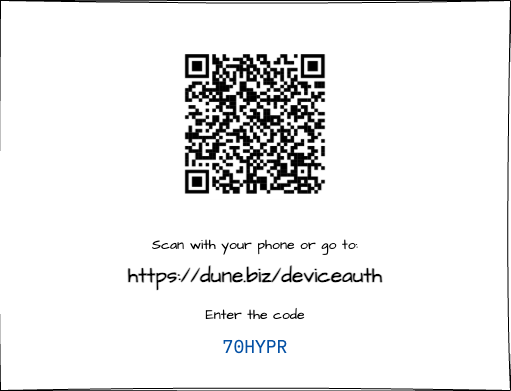

When the user scans the QR code or browses to the link on a browser, the user is asked to enter the `user_code` value.

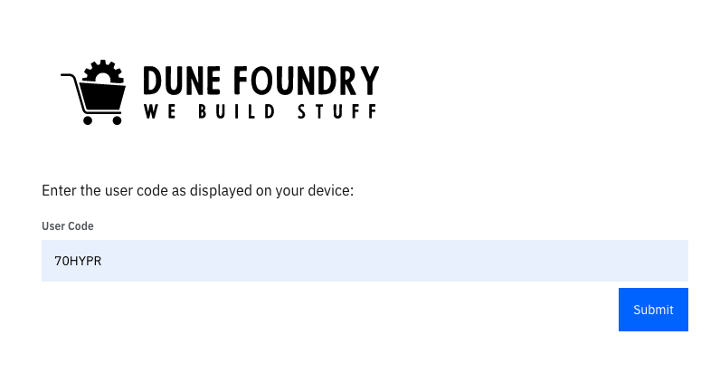

Once the user enters the user code, the user is taken through a login process and authorizes the request to proceed. This process can include the use of phishing resistant authenticators like passkeys and include adaptive MFA policies, etc.

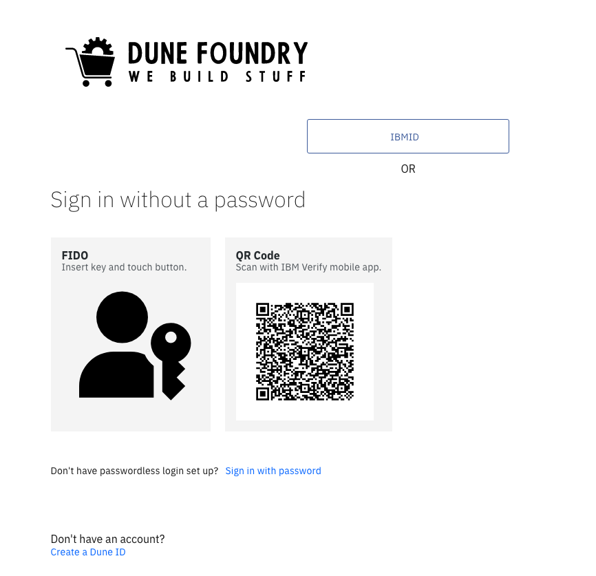

During this process on the device, it would usually poll for completion by invoking the token endpoint. 

```curl
curl 'https://abc.verify.ibm.com/oauth2/token' \
--header 'Content-Type: application/x-www-form-urlencoded' \
--data-urlencode 'client_id=device_client_id' \
--data-urlencode 'grant_type=urn:ietf:params:oauth:grant-type:device_code' \
--data-urlencode 'device_code=tKcKfPUA_hF1CIqS-uL1TxlHHg84qpVt1ssIWw7q6-E.eHPgVHStl7sG-GGN9M8GD8omTz38vavHT19idT5uKspT1O0K0k00bsyxIhNow4Y_2Ij1SEPTzyDV7t_v8BG9NQ'
```
> 📘 Note
> 
> While the example above shows the use of a public client, IBM Verify offers multiple client authentication methods, including the use of client secrets, JWTs, client certifications etc. The public client is used here to demonstrate the phishing attack, which is the purpose of this article.

When the user completes the sign in process, the token call returns a valid access token that can then be used to call protected APIs from the consuming device.

In the event that the `verification_uri_complete` is used, the user is not asked to enter the user code. The user simply completes authentication.

## The attack

With the use of a public OAuth 2.0 client, it is safe to assume the `client_id` has been stolen. Thus, the adversary can make the API call to the `device_authorization` endpoint to obtain a valid set of codes and the `verification_uri_complete`. Now consider that the adversary uses standard phishing techniques - a legitimate looking email etc. - to pass along the verification URI to the user. When the user completes the authorization flow, the adversary now has a legitimate access token that can be used to access protected resources.

Notice here that the user may use the strongest form of authentication and is still prone to this form of an attack.

## Mitigations

There are different ways to protect the user from this form of an attack.

### Use a confidential OAuth 2.0 client

Use a confidential client with a strong form of client authentication, such as `private_key_jwt` or `tls_client_auth`. IBM Verify offers the full complement of options supported by the standards.

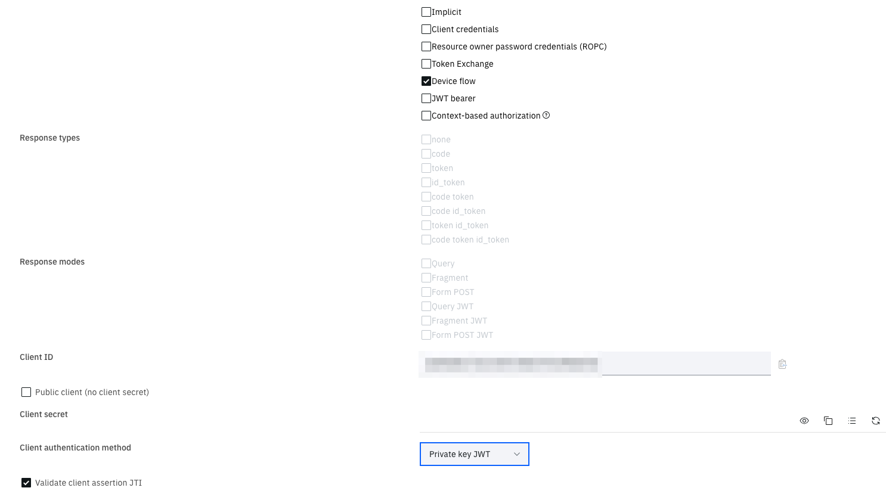

However, while this should always be the recommended approach to take, there are cases where this may not be practical. For example - an app that is installed on end user devices, where packaging a secret, such as a private key is not practical unless a sophisticated registration process is possible for the app instance.

### Add a consent page that provides additional context to the user

The device flow standard recommends the following.

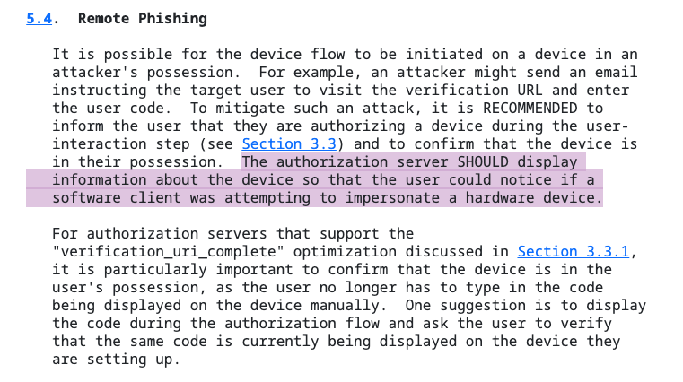

You can accomplish this in IBM Verify by displaying a consent page that shows the user code and provides information, such as the following.

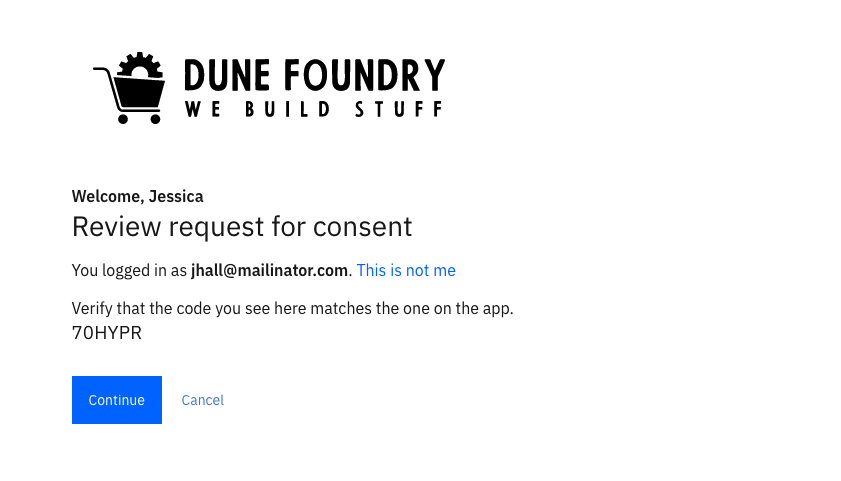

In order to achieve this experience, follow the steps as below.


#### Configure the Attribute representing the user code

1. Go to Directory > Attributes on the IBM Verify Admin Console.

    

2. Begin the process of adding a fixed value attribute. This will act as a placeholder representing the user code.

    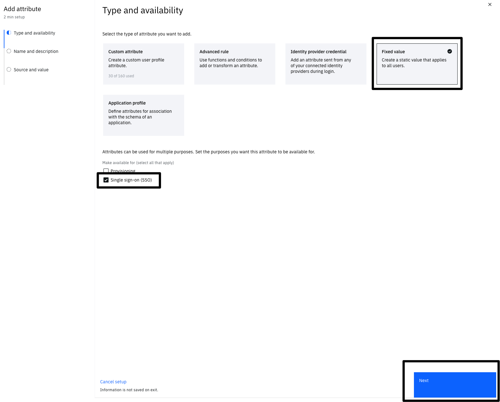

3. Name the attribute "User Code" with a specific identifier called "user_code". The ID is important because this is used later.

    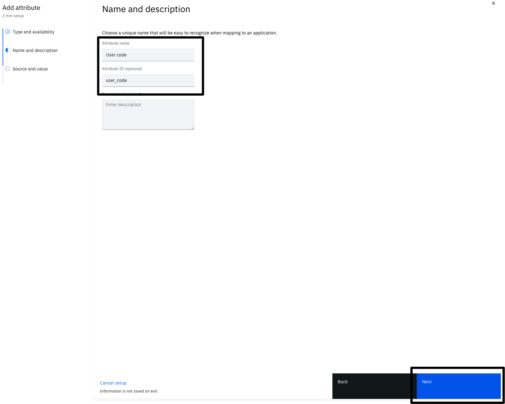

4. Set a default value. This value is never used.

    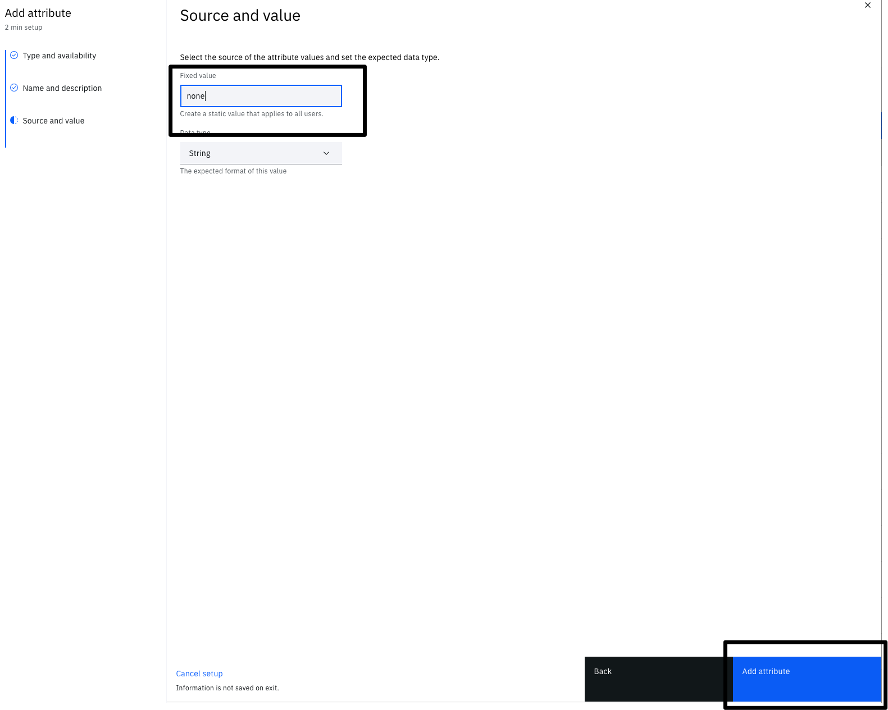

5. Attribute has been added.

    

#### Configure the Data Privacy purpose representing the user approval

1. Go to Data privacy and consent > Data purposes

    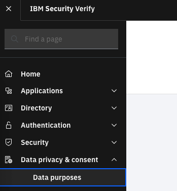

2. Begin the process to create the purpose. The purpose ID must be set to `user_code_approval`. This value is used later.

    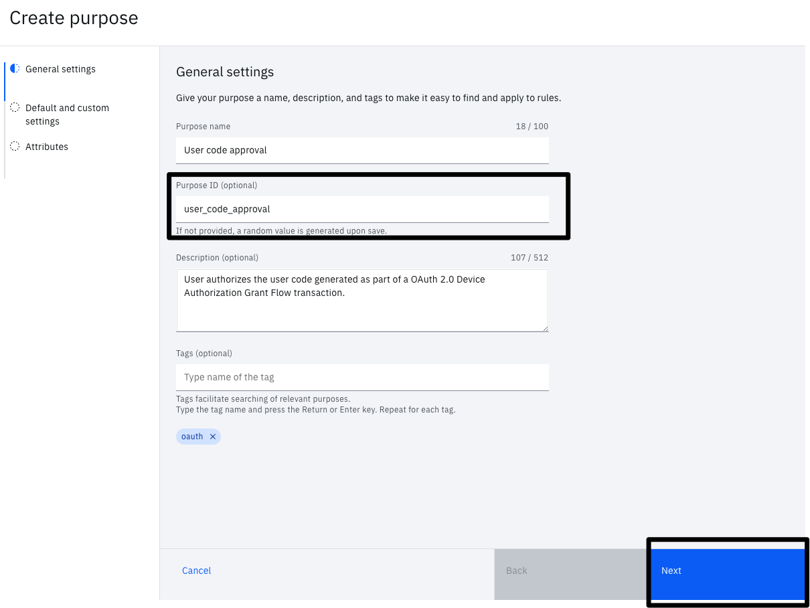

3. Choose the default access type.

    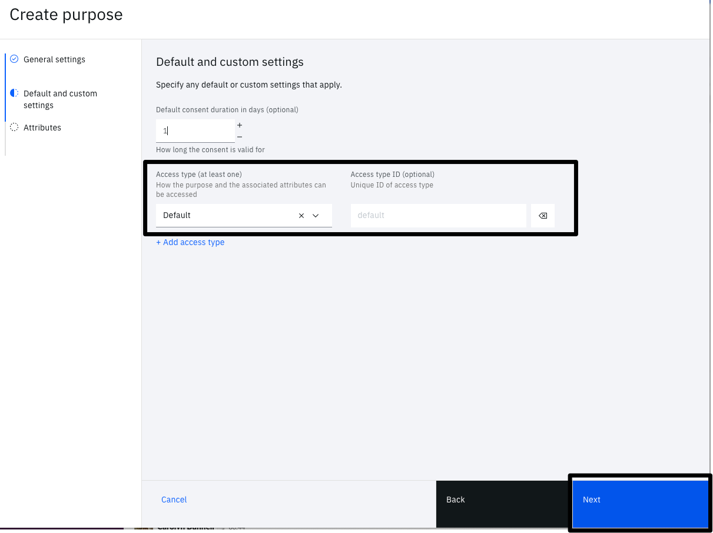

4. Add the user code attribute to the purpose.

    

5. Publish the data purpose.

    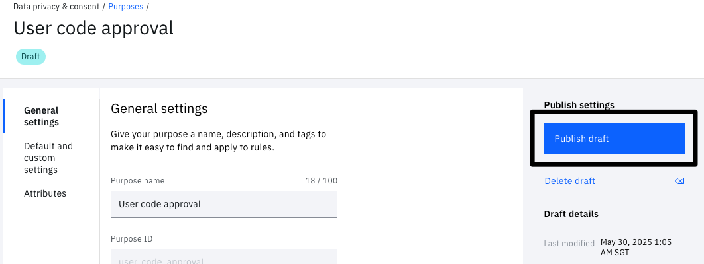

6. The purpose has been created.

    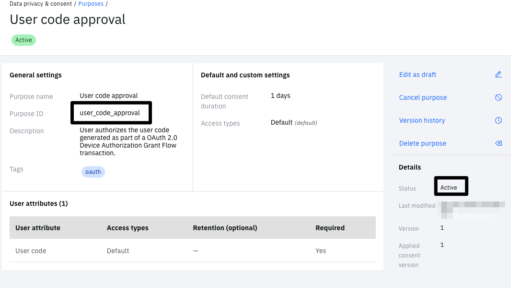

#### Update the application configured to use device flow

The expectation is the application has already been configured to use device flow and is using the OpenID Connect application type from the catalog.

1. Navigate to the application and edit. Go to the "Sign on" tab.

2. Scroll down to the Endpoint Configuration section and edit the Authorize endpoint settings. This will pop a modal dialog up.

    

3. Edit the Consent Request.

    

4. Copy the expression below and paste it in the code editor. This uses the CELx language that IBM Verify uses for scripting safely.

    ```yaml
    statements:
    # If the user code is present in the request, add it to the consent request items.
    - context: >
        user_code_scope := requestContext.getValue("user_code") != "" ? [{
            "purpose": "user_code_approval",
            "attribute": "user_code",
            "value": requestContext.getValue("user_code")
        }] : []
    # Auto-authorize all requested OAuth scopes.
    # If you don't want the client requesting
    # any OAuth scopes, just drop this entire statement and return
    # the context.user_code_scope.
    - context: >
        auto_grant_scopes := has(requestContext.scope) ? requestContext.scope.map(x, {
            "purpose": "ibm-oauth-scope",
            "attribute": x,
            "scope": x,
            "autoGrant": true
        }) : []
    - return: >
        context.user_code_scope + context.auto_grant_scopes
    ```

    The editor will look as below. Click OK.

    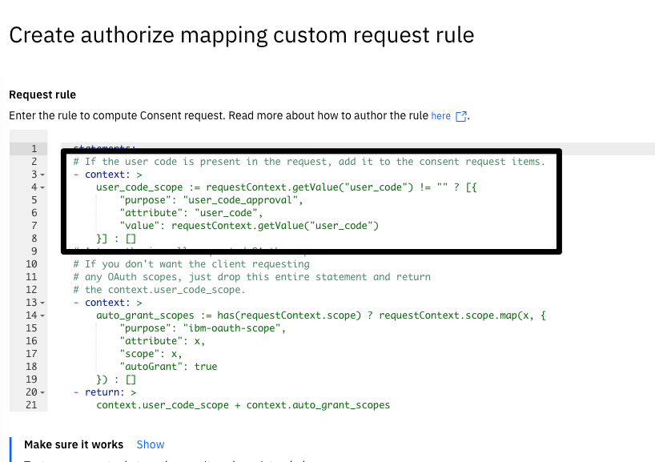

5. Scroll down in the "Sign on" tab and ensure the consent action is configured to ask for consent.

    

6. Save the application.

7. Go to the "Privacy" tab and add a purpose.

    

8. Add the "User code approval" purpose to the list of allowed purposes for this application.

    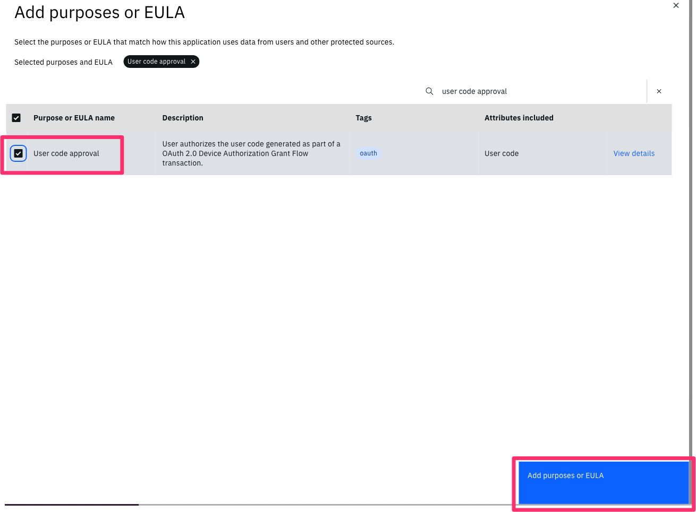

9. Save the application.

    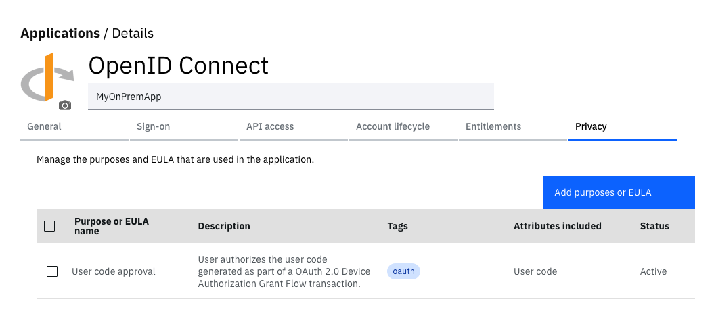

#### Update the consent page template

The consent page is a customizable HTML template in a theme.

1. Go to "User experience" > "Branding".

    

2. Choose the appropriate theme that is associated with your application.

    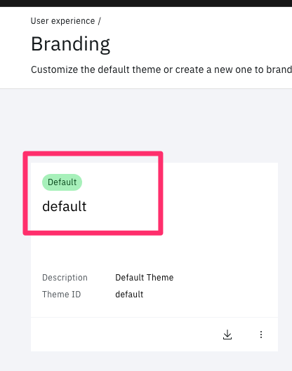

3. Navigate to the OIDC user consent page and edit. This is illustrated in the picture.

    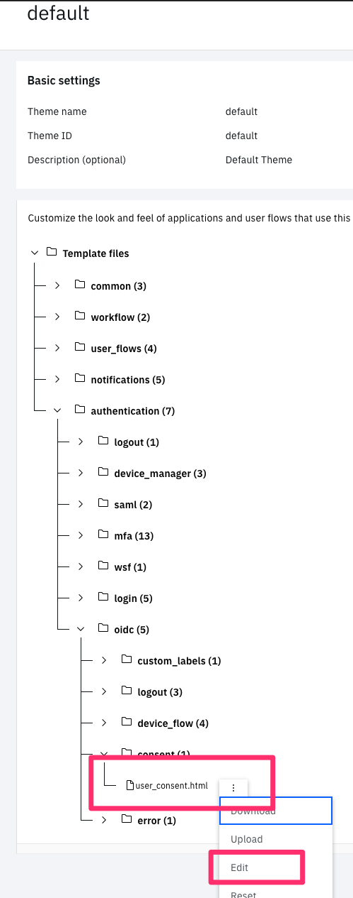

4. Above the "consent_form_verifier" hidden field and the submit button, add the following snippet. You may re-style this as needed. This segment shows the code to the user and provides any appropriate instructions.

    ```html
    [RPT purpose_user_code_authorization]
    <div class="bx--form-item">
        <p>Verify that the code you see here matches the one on the app.</p>
        <div style="font-size:14pt">
        @PRIVACY_SCOPE_ATTRVALUE_REPEAT@
        </div>
    </div>
    [ERPT purpose_user_code_authorization]
    ```

5. Click Save.

#### Run the flow

You can now repeat the device flow and you will notice the additional consent page that shows the user the code and instructions to compare it to the one displayed on the application. Adjust the wording as appropriate.

## The wrap

This article introduced some of the security implications of using the OAuth 2.0 Device Authorization Grant flow, in particular, with public clients. While the use of public clients may be unavoidable in certain situations, adding additional context for a user to make a decision helps reduce the chances of a successful phishing attack.